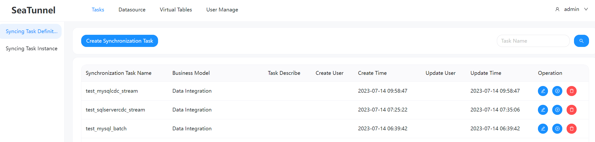

# Apache SeaTunnel


[](https://github.com/apache/seatunnel/actions/workflows/backend.yml)
[](https://join.slack.com/t/apacheseatunnel/shared_invite/zt-123jmewxe-RjB_DW3M3gV~xL91pZ0oVQ)
[](https://twitter.com/ASFSeaTunnel)

---
[](README.md)

SeaTunnel was formerly named Waterdrop , and renamed SeaTunnel since October 12, 2021.

---

So, What we are?

An open-source web console to manage your seatunnel-script, and would push them to any scheduling-system easily.
Click it if your want to know more about our design. 👉🏻[Design](https://github.com/apache/seatunnel/issues/1947)


## How to start

Notice: Some details please refer to the docs/QuickStart.md

### 1 Preparing the Apache SeaTunnel environment

Because SeaTunnel Web uses the SeaTunnel Java Client to submit jobs, running SeaTunnel Web requires preparing a SeaTunnel Zeta Engine service first.

Based on the usage requirements of SeaTunnel Zeta Engine, the SeaTunnel Client node that submits the job must have the same operating system and installation directory structure as the SeaTunnel Server node that runs the job. Therefore, if you want to run SeaTunnel Web in IDEA, you must install and run a SeaTunnel Zeta Engine Server on the same machine as the IDEA.

Don't worry, the next steps will tell you how to correctly install SeaTunnel Zeta Engine Server in different situations.

### 2 Run SeaTunnel Web in IDEA

If you want to deploy and run SeaTunnel Web, Please turn to [3 Run SeaTunnel Web In Server](#3 Run SeaTunnel Web In Server)

#### 2.1 Install SeaTunnel Zeta Engine Server
You have two ways to get the SeaTunnel installer package. Build from source code or download from the SeaTunnel website.

**The SeaTunnel version used here is only for writing this document to show you the process used, and does not necessarily represent the correct version. SeaTunnel Web and SeaTunnel Engine have strict version dependencies, and you can confirm the specific version mapping through xxx. Now only support build SeaTunnel Web and Seatunnel Zeta Engine in local, Because it is necessary to ensure that the seatunnel-api in SeaTunnel Web and the version in SeaTunnel Zeta Engine are the same.**

##### 2.1.1 Build from source code and deploy
* Get the source package from https://seatunnel.apache.org/download or https://github.com/apache/seatunnel.git
* Build installer package use maven command `./mvnw -U -T 1C clean install -DskipTests -D"maven.test.skip"=true -D"maven.javadoc.skip"=true -D"checkstyle.skip"=true -D"license.skipAddThirdParty" `
* After building, it is necessary to set an environment variable `ST_WEB_BASEDIR_PATH` to represent the location of the data source shade package. A custom class loader will be used to load the data source shade package based on this. For example: `ST_WEB_BASEDIR_PATH=/seatunnel-web-dist/target/apache-seatunnel-web-1.0.0-SNAPSHOT/`
* Then you can get the installer package in `${Your_code_dir}/seatunnel-dist/target`, For example:`apache-seatunnel-2.3.3-SNAPSHOT-bin.tar.gz`
* Run `tar -zxvf apache-seatunnel-2.3.3-SNAPSHOT-bin.tar.gz` to unzip the installer package.
* Run `cd apache-seatunnel-2.3.3-SNAPSHOT & sh bin/seatunnel-cluster.sh -d` to run the SeaTunnel Zeta Engine Server.
* Please confirm that port 5801 is being monitored by the SeaTunnelServer process. 

##### 2.1.2 Download installer package and deploy
The other way to install SeaTunnel Zeta Engine Server is download the installer package from https://seatunnel.apache.org/download and deploy.

* Download and install connector plugin(Some third-party dependency packages will also be automatically downloaded and installed during this process, such as hadoop jar). You can get the step from https://seatunnel.apache.org/docs/2.3.2/start-v2/locally/deployment.
* Run `cd apache-seatunnel-2.3.2 & sh bin/seatunnel-cluster.sh -d` to run the SeaTunnel Zeta Engine Server.

#### 2.2 Init database 

1. Edit `seatunnel-server/seatunnel-app/src/main/resources/script/seatunnel_server_env.sh` file, Complete the installed database address, port, username, and password. Here is an example:

    ```
    export HOSTNAME="localhost"
    export PORT="3306"
    export USERNAME="root"
    export PASSWORD="123456"
    ```
2. Run init shell `sh seatunnel-server/seatunnel-app/src/main/resources/script/init_sql.sh` If there are no errors during operation, it indicates successful initialization.

#### 2.3 Build the project

```shell
sh build.sh code
```

#### 2.4 Config application and Run SeaTunnel Web Backend Server

1. Edit `seatunnel-server/seatunnel-app/src/main/resources/application.yml` Fill in the database connection information


2. Copy `apache-seatunnel-2.3.3-SNAPSHOT/connectors/plugin-mapping.properties` file to `seatunnel-web/seatunnel-server/seatunnel-app/src/main/resources` dir.
3. Run `seatunnel-server/seatunnel-app/src/main/java/org/apache/seatunnel/app/SeatunnelApplication.java` If there are no errors reported, the seatunnel web backend service is successfully started. Notice that, you must set `-DSEATUNNEL_HOME=${your_seatunnel_install_path}` like this:


Because the data source plugin is dynamically loaded, it is necessary to set relevant environment variables:


#### 2.3 Run SeaTunnel Web Front End

```
cd seatunnel-ui
npm install
npm run dev

```

If there are no issues with the operation, the following information will be displayed:

```
  ➜  Local:   http://127.0.0.1:5173/
  ➜  Network: use --host to expose
  ➜  press h to show help

```

Accessing in a browser http://127.0.0.1:5173/login Okay, the default username and password are admin/admin.

### 3 Run SeaTunnel Web In Server
To run SeaTunnel Web on the server, you need to first have a SeaTunnel Zeta Engine Server environment. If you do not already have one, you can refer to the following steps for deployment.

#### 3.1 Deploy SeaTunnel Zeta Engine Server In Server Node

You have two ways to get the SeaTunnel installer package. Build from source code or download from the SeaTunnel website.

**The SeaTunnel version used here is only for writing this document to show you the process used, and does not necessarily represent the correct version. SeaTunnel Web and SeaTunnel Engine have strict version dependencies, and you can confirm the specific version mapping through xxx**

##### 3.1.1 Build from source code
* Get the source package from https://seatunnel.apache.org/download or https://github.com/apache/seatunnel.git
* Build installer package use maven command `./mvnw -U -T 1C clean install -DskipTests -D"maven.test.skip"=true -D"maven.javadoc.skip"=true -D"checkstyle.skip"=true -D"license.skipAddThirdParty" `
* Then you can get the installer package in `${Your_code_dir}/seatunnel-dist/target`, For example:`apache-seatunnel-2.3.3-SNAPSHOT-bin.tar.gz`

##### 3.1.2 Download installer package
The other way to get SeaTunnel Zeta Engine Server installer package is download the installer package from https://seatunnel.apache.org/download and install plugins online.

* Download and install connector plugin(Some third-party dependency packages will also be automatically downloaded and installed during this process, such as hadoop jar). You can get the step from https://seatunnel.apache.org/docs/2.3.2/start-v2/locally/deployment.
* After completing the previous step, you will receive an installation package that can be used to install SeaTunnel Zeta Engine Server on the server. Run `tar -zcvf apache-seatunnel-2.3.3-SNAPSHOT-bin.tar.gz apache-seatunnel-2.3.3-SNAPSHOT` 

##### 3.1.3 Deploy SeaTunnel Zeta Server
After 3.1.1 or 3.1.2 you can get an installer package `apache-seatunnel-2.3.3-SNAPSHOT-bin.tar.gz`, Then you can copy it to you server node and deploy reference https://seatunnel.apache.org/docs/seatunnel-engine/deployment.

##### 3.1.4 Deploy SeaTunnel Zeta Client In SeaTunnel Web Run Node
If you use SeaTunnel Web, you need deploy a SeaTunnel Zeta Client in the SeaTunnel Web run Node. **If you run SeaTunnel Zeta Server and SeaTunnel Web in same node, you can skip this step**.

* Copy `apache-seatunnel-2.3.3-SNAPSHOT-bin.tar.gz` to the SeaTunnel Web node and unzip it **in the same path of SeaTunnel Zeta Server node**.
* Set `SEATUNNEL_HOME` to environment variable like SeaTunnel Zeta Server node.
* Config `hazelcast-client.yaml` reference https://seatunnel.apache.org/docs/seatunnel-engine/deployment#6-config-seatunnel-engine-client
* Run `$SEATUNNEL_HOME/bin/seatunnel.sh --config $SEATUNNEL_HOME/config/v2.batch.config.template`, If this job run finished, it indicates successful client deployment.

#### 3.2 Build SeaTunnel Web Install Package From Code

```
cd seatunnel-web
sh build.sh code
```

Then you can find the installer package in dir `seatunnel-web/seatunnel-web-dist/target/apache-seatunnel-web-${project.version}.tar.gz`.

#### 3.3 Install

Copy the `apache-seatunnel-web-${project.version}.tar.gz` to your server node and unzip it.

```shell
tar -zxvf apache-seatunnel-web-${project.version}.tar.gz
```

#### 3.4 Init database

1. Edit `apache-seatunnel-web-${project.version}/script/seatunnel_server_env.sh` file, Complete the installed database address, port, username, and password. Here is an example:

    ```
    export HOSTNAME="localhost"
    export PORT="3306"
    export USERNAME="root"
    export PASSWORD="123456"
    ```
2. Run init shell `sh apache-seatunnel-web-${project.version}/script/init_sql.sh` If there are no errors during operation, it indicates successful initialization.

#### 3.5 Config application and Run SeaTunnel Web Backend Server

* Edit `apache-seatunnel-web-${project.version}/conf/application.yml` Fill in the database connection information and DS interface related information in the file.


* Copy `$SEATUNNEL_HOME/config/hazelcast-client.yaml` to `apache-seatunnel-web-${project.version}/conf/`
* Copy `apache-seatunnel-2.3.3-SNAPSHOT/connectors/plugin-mapping.properties` file to `apache-seatunnel-web-${project.version}/conf/` dir.

#### 3.6 Start SeaTunnel Web

```shell
cd apache-seatunnel-web-${project.version}
sh bin/seatunnel-backend-daemon.sh start
```

Accessing in a browser http://127.0.0.1:8801/ui/ Okay, the default username and password are admin/admin.

### How to use it

After all the pre-work is done, we can open the following URL: 127.0.0.1:7890(please replace it according to your configuration) to use it.

Now ,let me show you how to use it.

#### User manage


#### Task manage


#### Datasource manage


#### Virtual Tables manage

