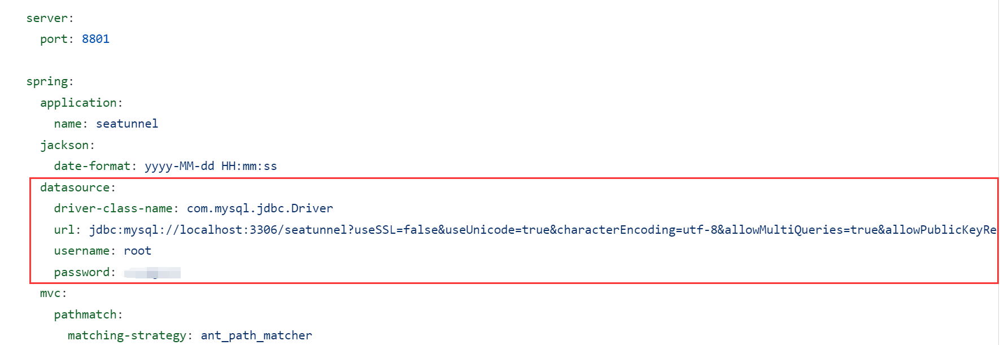
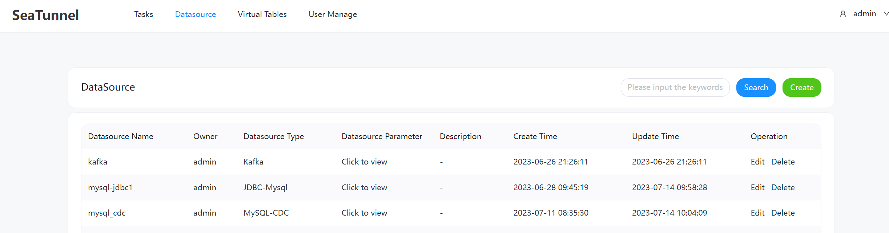

# Apache SeaTunnel


[](https://github.com/apache/seatunnel/actions/workflows/backend.yml)
[](https://join.slack.com/t/apacheseatunnel/shared_invite/zt-123jmewxe-RjB_DW3M3gV~xL91pZ0oVQ)
[](https://twitter.com/ASFSeaTunnel)

---
[](README.md)

SeaTunnel的前身是Waterdrop，并于2021年10月12日更名为SeaTunnel。

---

那么，SeaTunnel是什么?
SeaTunnel是下一代超高性能、分布式、海量数据集成工具。它每天可以稳定高效地同步数百亿个数据，并已在许多公司的生产中使用。SeaTunnel-web为SeaTunnel提供可视化界面，方便用户使用Apache SeaTunnel。

如果你想知道更多关于SeaTunnel的设计。 👉🏻[设计](https://github.com/apache/seatunnel/issues/1947)


## 如何开始

注意:一些细节请参考 docs/QuickStart.md

### 1 准备Apache SeaTunnel环境

因为SeaTunnel Web使用SeaTunnel Java客户端来提交作业，所以运行SeaTunnel Web需要首先准备SeaTunnel Zeta Engine服务。

根据SeaTunnel Zeta Engine的使用要求，提交作业的SeaTunnel Client节点必须与运行作业的SeaTunnel Server节点具有相同的操作系统和安装目录结构。比如如果你想在本地IDEA中运行SeaTunnel Web，你必须在与IDEA相同的机器上安装和运行SeaTunnel Zeta引擎服务器。

别担心，接下来的步骤将告诉您如何在不同情况下正确安装SeaTunnel Zeta Engine Server。
### 2 在IDEA中运行SeaTunnel Web

如果您想部署和运行SeaTunnel Web，请转到 [3 Run SeaTunnel Web In Server](#3 Run SeaTunnel Web In Server)

#### 2.1 安装SeaTunnel Zeta引擎服务器
有两种方法可以获得SeaTunnel安装包。从源代码构建或从SeaTunnel网站下载。

**此处使用的SeaTunnel版本仅用于编写本文档以向您展示所使用的过程，并不一定代表正确的版本。SeaTunnel Web和SeaTunnel Engine有严格的版本依赖关系，您可以通过确认具体的版本对应关系。现在只支持在本地构建SeaTunnel Web和SeaTunnel Zeta Engine，因为有必要确保SeaTunnel Web中的SeaTunnel-api与SeaTunnel Zeta Engine中的版本相同**
##### 2.1.1 从源代码构建和部署
* 从https://seatunnel.apache.org/download 或 https://github.com/apache/seatunnel.git 获取源包
* 构建安装包使用maven命令。`./mvnw -U -T 1C clean install -DskipTests -D"maven.test.skip"=true -D"maven.javadoc.skip"=true -D"checkstyle.skip"=true -D"license.skipAddThirdParty" `
* 在构建之后，需要设置一个环境变量`ST_WEB_BASEDIR_PATH`来表示数据源shade包的位置。将使用自定义类加载器来基于此加载数据源shade包。例如:`ST_WEB_BASEDIR_PATH=/seatunnel-web-dist/target/apache-seatunnel-web-1.0.0-SNAPSHOT/`
然后你可以在`${Your_code_dir}/seatunnel-dist/target`下获取安装包，例如:`apache-seatunnel-2.3.3-SNAPSHOT-bin.tar.gz`。
* 执行`tar -zxvf apache-seatunnel-2.3.3-SNAPSHOT-bin.tar.gz`解压安装包。
* 运行`cd apache-seatunnel-2.3.3-SNAPSHOT & sh bin/seatunnel-cluster.sh -d`运行SeaTunnel Zeta Engine Server。
* SeaTunnel Zeta Engine Server默认占用5801端口，请确认端口5801正在被SeaTunnelServer进程占用。

##### 2.1.2 下载安装程序包并进行部署
下载安装包并部署SeaTunnel Zeta Engine Server的另一种安装方式是从https://seatunnel.apache.org/download 下载安装包并部署。

* 下载并安装连接器插件(一些第三方依赖包也会在此过程中自动下载并安装，如Hadoop jar)。您可以从https://seatunnel.apache.org/docs/2.3.2/start-v2/locally/deployment 获得该步骤。
* 运行`cd apache-seatunnel-2.3.2 & sh bin/seatunnel-cluster.sh -d`运行seattunnel Zeta Engine Server。
#### 2.2 初始化数据库

1. 编辑 `seatunnel-server/seatunnel-app/src/main/resources/script/seatunnel_server_env.sh` 文件, 填写已安装的数据库 address, port, username, and password. 下面是一个例子:

    ```
    export HOSTNAME="localhost"
    export PORT="3306"
    export USERNAME="root"
    export PASSWORD="123456"
    ```
2. 执行命令 `sh seatunnel-server/seatunnel-app/src/main/resources/script/init_sql.sh` 如果运行过程中没有错误，则说明初始化成功。

#### 2.3 构建项目

```shell
sh build.sh code
```

#### 2.4 配置应用程序并运行SeaTunnel Web后端服务器

1. 编辑 `seatunnel-server/seatunnel-app/src/main/resources/application.yml` 写数据库连接信息



2. 复制 `apache-seatunnel-2.3.3-SNAPSHOT/connectors/plugin-mapping.properties` 文件 到 `seatunnel-web/seatunnel-server/seatunnel-app/src/main/resources` 目录.
3. 运行 `seatunnel-server/seatunnel-app/src/main/java/org/apache/seatunnel/app/SeatunnelApplication.java` 如果没有报错，说明seatunnel web后端服务启动成功。注意，你必须设置 `-DSEATUNNEL_HOME=${your_seatunnel_install_path}` 像这样:


由于数据源插件是动态加载的，所以需要设置相关的环境变量:


#### 2.3 运行SeaTunnel Web Front End

```
cd seatunnel-ui
npm install
npm run dev

```

如果操作正常，系统显示如下信息:

```
  ➜  Local:   http://127.0.0.1:5173/
  ➜  Network: use --host to expose
  ➜  press h to show help

```

在浏览器中访问 `http://127.0.0.1:5173/login` , 默认用户名和密码是 `admin/admin`

### 3 在服务器上运行 SeaTunnel Web
要在服务器上运行SeaTunnel Web，首先需要有一个SeaTunnel Zeta引擎服务器环境。如果还没有，可以参考以下步骤进行部署。

#### 3.1 在Server Node中部署SeaTunnel Zeta Engine Server

有两种方法可以获得SeaTunnel安装包。从源代码构建或从SeaTunnel网站下载。

**此处使用的SeaTunnel版本仅用于编写本文档以向您展示所使用的过程，并不一定代表正确的版本。SeaTunnel Web和SeaTunnel Engine有严格的版本依赖关系，您可以通过xxx确认具体的版本对应关系**

##### 3.1.1 从源码编译
* 从 https://seatunnel.apache.org/download 或 https://github.com/apache/seatunnel.git 获取源码包
* 使用maven命令编译安装包 `./mvnw -U -T 1C clean install -DskipTests -D"maven.test.skip"=true -D"maven.javadoc.skip"=true -D"checkstyle.skip"=true -D"license.skipAddThirdParty" `
* 然后您可以在`${您的代码目录}/seatunnel-dist/target`中获得安装包,例如:`apache-seatunnel-2.3.3-SNAPSHOT-bin.tar.gz`

##### 3.1.2 下载安装包
获取 SeaTunnel Zeta 引擎服务安装包的另一种方式是从 https://seatunnel.apache.org/download 下载安装包并在线安装插件。

* 下载并安装连接器插件(这个过程中也会自动下载和安装一些第三方依赖包,比如 hadoop jar)。您可以参考 https://seatunnel.apache.org/docs/2.3.2/start-v2/locally/deployment 获取详细步骤。
* 完成上述步骤后,您将获得一个可以用于在服务器上安装 SeaTunnel Zeta 引擎服务的安装包。运行 `tar -zcvf apache-seatunnel-2.3.3-SNAPSHOT-bin.tar.gz apache-seatunnel-2.3.3-SNAPSHOT`

##### 3.1.3 部署 SeaTunnel Zeta 服务端

在完成 3.1.1 或 3.1.2 后您可以获得一个安装包 `apache-seatunnel-2.3.3-SNAPSHOT-bin.tar.gz`,然后您可以将其复制到服务器节点并参考 https://seatunnel.apache.org/docs/seatunnel-engine/deployment 进行部署。

##### 3.1.4 在 SeaTunnel Web 运行节点部署 SeaTunnel Zeta 客户端

如果您使用 SeaTunnel Web,您需要在 SeaTunnel Web 运行节点部署一个 SeaTunnel Zeta 客户端。**如果 SeaTunnel Zeta 服务端和 SeaTunnel Web 在同一节点,您可以跳过此步骤**。

* 将 `apache-seatunnel-2.3.3-SNAPSHOT-bin.tar.gz` 复制到 SeaTunnel Web 节点并解压,解压**到与 SeaTunnel Zeta 服务端节点相同的路径下**。
* 和 SeaTunnel Zeta 服务端节点相同,设置 `SEATUNNEL_HOME` 环境变量。
* 参考 https://seatunnel.apache.org/docs/seatunnel-engine/deployment#6-config-seatunnel-engine-client 配置 `hazelcast-client.yaml`。
* 运行 `$SEATUNNEL_HOME/bin/seatunnel.sh --config $SEATUNNEL_HOME/config/v2.batch.config.template`,如果该作业运行结束,表示客户端部署成功。

#### 3.2 从源码构建 SeaTunnel Web 安装包

```
cd seatunnel-web
sh build.sh code
```

然后您可以在 `seatunnel-web/seatunnel-web-dist/target/apache-seatunnel-web-${project.version}.tar.gz` 目录中获得安装包。

#### 3.3 安装

将 `apache-seatunnel-web-${project.version}.tar.gz` 复制到服务器节点并解压。

```shell
tar -zxvf apache-seatunnel-web-${project.version}.tar.gz
```shell
tar -zxvf apache-seatunnel-web-${project.version}.tar.gz
```

#### 3.4 初始化数据库

1. 编辑 `apache-seatunnel-web-${project.version}/script/seatunnel_server_env.sh` 文件, 填写已安装的数据库 address, port, username, and password. 例如:

    ```
    export HOSTNAME="localhost"
    export PORT="3306"
    export USERNAME="root"
    export PASSWORD="123456"
    ```
2. 运行初始化脚本 `sh apache-seatunnel-web-${project.version}/script/init_sql.sh` 如果操作过程中没有错误,表示初始化成功。

#### 3.5 配置应用并运行 SeaTunnel Web 后端服务

* 编辑 `apache-seatunnel-web-${project.version}/conf/application.yml` 在文件中填写数据库连接信息和数据服务接口相关信息。


* 复制 `$SEATUNNEL_HOME/config/hazelcast-client.yaml` 到 `apache-seatunnel-web-${project.version}/conf/`
* 复制 `apache-seatunnel-2.3.3-SNAPSHOT/connectors/plugin-mapping.properties` 文件到 `apache-seatunnel-web-${project.version}/conf/` 目录.

#### 3.6 运行 SeaTunnel Web

```shell
cd apache-seatunnel-web-${project.version}
sh bin/seatunnel-backend-daemon.sh start
```

在浏览器中访问 http://127.0.0.1:8801/ui/ , 默认用户名和密码是 admin/admin.

### 如何使用

完成所有前置工作后,我们可以打开以下网址: http://127.0.0.1:7890(请根据您的配置替换)来使用它。

现在,让我向您展示如何使用它。

#### 用户管理


#### 任务管理


#### 数据源管理


#### 虚拟表

