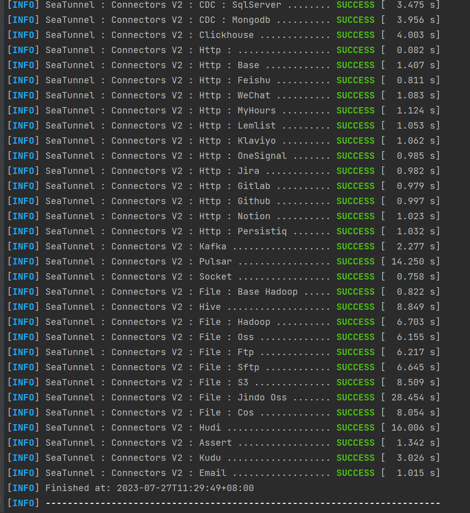

# 1.SeaTunnel 配置

## 1.1拉取SeaTunnel代码

github地址： https://github.com/apache/seatunnel

## 1.2Install SeaTunnel

1. 检查SeaTunnel version ,在根目录的pom文件中

   ​														

2. 在终端中输入命令 ： ./mvnw clean install '-Dmaven.test.skip=true' '-Dcheckstyle.skip=true   或者输入 mvn clean install -DskipTests=true

3. 执行完成后，显示如下：

## 1.3启动SeaTunnel引擎

执行seatunnel-examples/seatunnel-engine-examples/src/main/java/org/apache/seatunnel/example/engine/SeaTunnelEngineServerExample.java文件，启动SeaTunnel引擎服务

# 2.SeaTunnel Web设置

## 2.1SeaTunnel依赖版本设置

在ST-Web跟目录的pom文件中设置SeaTunnel引擎版本，参考1.2中的SeaTunnel version

​	

## 2.2添加 Connector依赖

假如你想使用Kafka作为数据源，需要在两个地方添加Kafka连接器的依赖

1. 在根目录的pom文件中的<dependencyManagement>中添加kafka连接器依赖管理（注意修改该依赖的<scope>（不要是test级别））

​			

2. 在seatunnel-server/seatunnel-app/pom.xml文件中添加kafka连接器依赖（注意修改该依赖的<scope>（不要是test级别））

​		

## 2.3 打包SeaTunnel Web 项目

使用命令  mvn clean install -DskipTests=true

## 2.4添加Enviroment variables

1. 当打包完成之后，在文件seatunnel-web-dist/target/apache-seatunnel-web-1.0.0-SNAPSHOT/apache-seatunnel-web-1.0.0-SNAPSHOT（在第三步中会用到）

2. 假如你使用的是IDEA，打开Edit Configurations

​		

3. 添加Enviroment variables，将apache-seatunnel-web-1.0.0-SNAPSHOT文件的绝对路径添加的Enviroment variables中，命名为ST_WEB_BASEDIR_PATH

​											

4. 在SeatunnelApplication.java 下启动ST-Web

# 3.QuickStart

打开链接： http://127.0.0.1:5173/login

初始用户名和密码都是admin

​														

## 3.1创建数据源

​				

选择一个你需要使用的数据源

## 3.2创建同步任务

